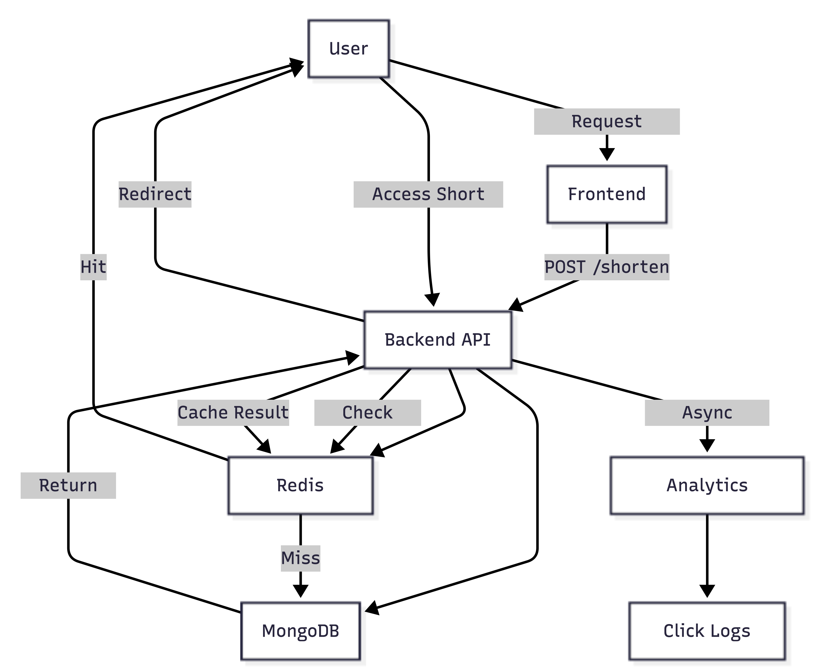

<!--
---
marp: true
theme: default
paginate: true
_class: lead
title: URL Shortener
description: Scalable URL Shortener System
---
-->

# URL Shortener

### Scalable Link Management System

---

## Overview

- A scalable URL shortening service built with Node.js, Express, MongoDB, and Redis.
- Enables efficient link generation, redirection, and analytics tracking.
- Designed with performance, reliability, and modular architecture.

---

## Features

- Create short URLs from long links
- Custom alias support
- Optional link expiration
- Fast redirection using Redis caching
- Click analytics (device, browser, location, referrer)
- Rate limiting for abuse protection
- Fault-tolerant design (operates even if Redis is unavailable)

---

## Tech Stack

### Backend
- Node.js
- Express

### Data Layer
- MongoDB (Mongoose)

### Performance Layer
- Redis

### Frontend (Optional)
- React

### Utilities
- Axios
- Helmet
- Morgan
- Rate Limiter

---

## How It Works

1. User submits a long URL  
2. Server generates a unique short ID or custom alias  
3. Mapping stored in MongoDB and cached in Redis  
4. User accesses short URL  
5. Backend resolves original URL and redirects  
6. Click data is logged asynchronously  

---

## Analytics

Tracks:

- Total clicks  
- Unique visitors  
- Device and browser usage  
- Country and city distribution  
- Referrer sources  

---

## Optimizations

- Cache-aside pattern using Redis  
- Cache stampede prevention  
- Negative caching for invalid URLs  
- MongoDB TTL index for auto-expiry  
- Async logging to avoid blocking redirects  

---

## System Flow

